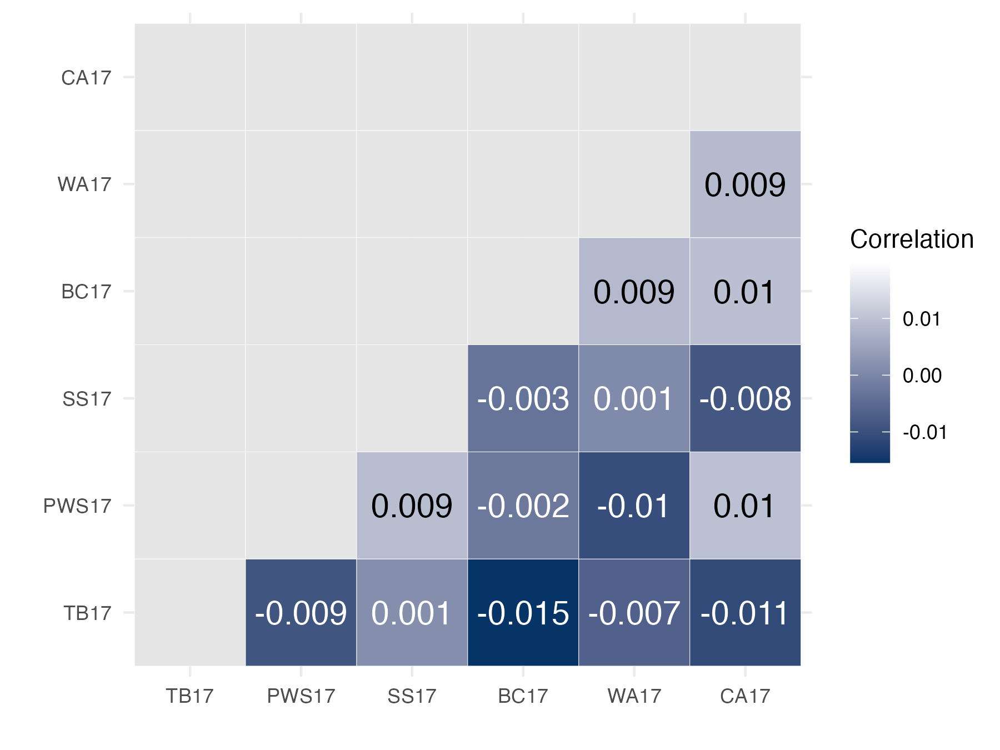

```{r eval=FALSE, message=FALSE, warning=FALSE}
source("../Rscripts/BaseScripts.R")
library(data.table)
library(DataCombine)
library(gridExtra)
library(scales)
library(corrplot)
library(gplots)
pops.info<-read.csv("../Data/Sample_metadata_892pops.csv")
pops<-unique(pops.info$Population.Year)
pops2<-pops[grep("17", pops)]
```

# Prepare SNPs for BayEnv
## Prune the VCF file with the strict standard and filter the loci 

```{bash eval=FALSE, message=FALSE, warning=FALSE}
#at farm (prune_vcf_froBayEnv.sh)
module load plink
#add variant ID names for pruning 
plink --vcf /home/ktist/ph/data/new_vcf/MD7000/PH_DP600_7000_minQ20_minMQ30_NS0.5_maf05.vcf.gz --set-missing-var-ids @:#[ph] --make-bed --out /home/ktist/ph/data/new_vcf/MD7000/plinkfiles/MD7000_maf0.05 

plink --bfile /home/ktist/ph/data/new_vcf/MD7000/plinkfiles/MD7000_maf0.05  --recode --tab --out /home/ktist/ph/data/new_vcf/MD7000/plinkfiles/MD7000_maf0.05 

plink --file  /home/ktist/ph/data/new_vcf/MD7000/plinkfiles/MD7000_maf0.05  --indep-pairwise 1000kb 1 0.15 --out /home/ktist/ph/data/new_vcf/MD7000/plinkfiles/prune_strict_1000k_0.15

#Different parameters (window size and R2 number) did not change the number of pruned loci drastically:
# indep-pairwise 50 5 0.5 (original parameters) = 270000 loci
# stricter parameters 1000k 1 0.15   = 205726

# Filter the vcf file (prune_convert_BAYENV.sh)
# First, reformat the prune.in  file as a 'CHR' 'POS' tab-delimited txt 
sed -e s/\\[ph\\]//g prune_strict_1000k_0.15.prune.in | awk  '{gsub(":","\t",$0); print;}' > prune_strict_1000k_0.15.in.txt

# Remove the pruned loci
bcftools view -R /home/ktist/ph/data/new_vcf/MD7000/plinkfiles/prune_strict_1000k_0.15.in.txt /home/ktist/ph/data/new_vcf/MD7000/PH_DP600_7000_minQ20_minMQ30_NS0.5_maf05.vcf.gz > /home/ktist/ph/data/new_vcf/MD7000/plinkfiles/pruned_strict_PH_all_maf05.vcf

bgzip /home/ktist/ph/data/new_vcf/MD7000/plinkfiles/pruned_strict_PH_all_maf05.vcf


# Subset the each file (subset_prunedVCF2.sh)
bcftools view -Oz -S /home/ktist/ph/data/new_vcf/population/BC17.txt --threads 24  /home/ktist/ph/data/new_vcf/MD7000/plinkfiles/pruned_strict_PH_all_maf05.vcf.gz > /home/ktist/ph/data/new_vcf/MD7000/plinkfiles/Pruned_BC17_maf05.vcf.gz
bcftools index /home/ktist/ph/data/new_vcf/MD7000/plinkfiles/Pruned_BC17_maf05.vcf.gz 
bcftools view -Oz -S /home/ktist/ph/data/new_vcf/population/CA17.txt --threads 24  /home/ktist/ph/data/new_vcf/MD7000/plinkfiles/pruned_strict_PH_all_maf05.vcf.gz > /home/ktist/ph/data/new_vcf/MD7000/plinkfiles/Pruned_CA17_maf05.vcf.gz
bcftools index /home/ktist/ph/data/new_vcf/MD7000/plinkfiles/Pruned_CA17_maf05.vcf.gz 
bcftools view -Oz -S /home/ktist/ph/data/new_vcf/population/PWS07.txt --threads 24  /home/ktist/ph/data/new_vcf/MD7000/plinkfiles/pruned_strict_PH_all_maf05.vcf.gz > /home/ktist/ph/data/new_vcf/MD7000/plinkfiles/Pruned_PWS07_maf05.vcf.gz
bcftools index /home/ktist/ph/data/new_vcf/MD7000/plinkfiles/Pruned_PWS07_maf05.vcf.gz 
bcftools view -Oz -S /home/ktist/ph/data/new_vcf/population/PWS17.txt --threads 24  /home/ktist/ph/data/new_vcf/MD7000/plinkfiles/pruned_strict_PH_all_maf05.vcf.gz > /home/ktist/ph/data/new_vcf/MD7000/plinkfiles/Pruned_PWS17_maf05.vcf.gz
bcftools index /home/ktist/ph/data/new_vcf/MD7000/plinkfiles/Pruned_PWS17_maf05.vcf.gz 
bcftools view -Oz -S /home/ktist/ph/data/new_vcf/population/PWS91.txt --threads 24  /home/ktist/ph/data/new_vcf/MD7000/plinkfiles/pruned_strict_PH_all_maf05.vcf.gz > /home/ktist/ph/data/new_vcf/MD7000/plinkfiles/Pruned_PWS91_maf05.vcf.gz
bcftools index /home/ktist/ph/data/new_vcf/MD7000/plinkfiles/Pruned_PWS91_maf05.vcf.gz 
bcftools view -Oz -S /home/ktist/ph/data/new_vcf/population/PWS96.txt --threads 24  /home/ktist/ph/data/new_vcf/MD7000/plinkfiles/pruned_strict_PH_all_maf05.vcf.gz > /home/ktist/ph/data/new_vcf/MD7000/plinkfiles/Pruned_PWS96_maf05.vcf.gz
bcftools index /home/ktist/ph/data/new_vcf/MD7000/plinkfiles/Pruned_PWS96_maf05.vcf.gz 
bcftools view -Oz -S /home/ktist/ph/data/new_vcf/population/SS06.txt --threads 24  /home/ktist/ph/data/new_vcf/MD7000/plinkfiles/pruned_strict_PH_all_maf05.vcf.gz > /home/ktist/ph/data/new_vcf/MD7000/plinkfiles/Pruned_SS06_maf05.vcf.gz
bcftools index /home/ktist/ph/data/new_vcf/MD7000/plinkfiles/Pruned_SS06_maf05.vcf.gz 
bcftools view -Oz -S /home/ktist/ph/data/new_vcf/population/SS17.txt --threads 24  /home/ktist/ph/data/new_vcf/MD7000/plinkfiles/pruned_strict_PH_all_maf05.vcf.gz > /home/ktist/ph/data/new_vcf/MD7000/plinkfiles/Pruned_SS17_maf05.vcf.gz
bcftools index /home/ktist/ph/data/new_vcf/MD7000/plinkfiles/Pruned_SS17_maf05.vcf.gz 
bcftools view -Oz -S /home/ktist/ph/data/new_vcf/population/SS96.txt --threads 24  /home/ktist/ph/data/new_vcf/MD7000/plinkfiles/pruned_strict_PH_all_maf05.vcf.gz > /home/ktist/ph/data/new_vcf/MD7000/plinkfiles/Pruned_SS96_maf05.vcf.gz
bcftools index /home/ktist/ph/data/new_vcf/MD7000/plinkfiles/Pruned_SS96_maf05.vcf.gz 
bcftools view -Oz -S /home/ktist/ph/data/new_vcf/population/TB06.txt --threads 24  /home/ktist/ph/data/new_vcf/MD7000/plinkfiles/pruned_strict_PH_all_maf05.vcf.gz > /home/ktist/ph/data/new_vcf/MD7000/plinkfiles/Pruned_TB06_maf05.vcf.gz
bcftools index /home/ktist/ph/data/new_vcf/MD7000/plinkfiles/Pruned_TB06_maf05.vcf.gz 
bcftools view -Oz -S /home/ktist/ph/data/new_vcf/population/TB17.txt --threads 24  /home/ktist/ph/data/new_vcf/MD7000/plinkfiles/pruned_strict_PH_all_maf05.vcf.gz > /home/ktist/ph/data/new_vcf/MD7000/plinkfiles/Pruned_TB17_maf05.vcf.gz
bcftools index /home/ktist/ph/data/new_vcf/MD7000/plinkfiles/Pruned_TB17_maf05.vcf.gz 
bcftools view -Oz -S /home/ktist/ph/data/new_vcf/population/TB91.txt --threads 24  /home/ktist/ph/data/new_vcf/MD7000/plinkfiles/pruned_strict_PH_all_maf05.vcf.gz > /home/ktist/ph/data/new_vcf/MD7000/plinkfiles/Pruned_TB91_maf05.vcf.gz
bcftools index /home/ktist/ph/data/new_vcf/MD7000/plinkfiles/Pruned_TB91_maf05.vcf.gz 
bcftools view -Oz -S /home/ktist/ph/data/new_vcf/population/TB96.txt --threads 24  /home/ktist/ph/data/new_vcf/MD7000/plinkfiles/pruned_strict_PH_all_maf05.vcf.gz > /home/ktist/ph/data/new_vcf/MD7000/plinkfiles/Pruned_TB96_maf05.vcf.gz
bcftools index /home/ktist/ph/data/new_vcf/MD7000/plinkfiles/Pruned_TB96_maf05.vcf.gz 
bcftools view -Oz -S /home/ktist/ph/data/new_vcf/population/WA17.txt --threads 24  /home/ktist/ph/data/new_vcf/MD7000/plinkfiles/pruned_strict_PH_all_maf05.vcf.gz > /home/ktist/ph/data/new_vcf/MD7000/plinkfiles/Pruned_WA17_maf05.vcf.gz
bcftools index /home/ktist/ph/data/new_vcf/MD7000/plinkfiles/Pruned_WA17_maf05.vcf.gz 

#Count the alleles (extract_AC.sh)
bcftools query -f '%CHROM  %POS  %INFO/AC  %INFO/AN\n' /home/ktist/ph/data/new_vcf/MD7000/plinkfiles/Pruned_PWS17_maf05.vcf.gz > /home/ktist/ph/data/new_vcf/MD7000/plinkfiles/pruned_AC_PWS17.txt 
bcftools query -f '%CHROM  %POS  %INFO/AC  %INFO/AN\n' /home/ktist/ph/data/new_vcf/MD7000/plinkfiles/Pruned_PWS91_maf05.vcf.gz > /home/ktist/ph/data/new_vcf/MD7000/plinkfiles/pruned_AC_PWS91.txt 
bcftools query -f '%CHROM  %POS  %INFO/AC  %INFO/AN\n' /home/ktist/ph/data/new_vcf/MD7000/plinkfiles/Pruned_PWS96_maf05.vcf.gz > /home/ktist/ph/data/new_vcf/MD7000/plinkfiles/pruned_AC_PWS96.txt 

```


## Create Allele Count file 
* Used the outputs from extract_AC.sh to get the allele counts for each population at each loci

```{r eval=FALSE, message=FALSE, warning=FALSE}
pops.info<-read.csv("../Data/Sample_metadata_892pops.csv")
pops<-unique(pops.info$Population.Year)

#Pruned position info
prun<-read.table("../Data/new_vcf/AC/Pruned_positions.txt")
prun$V1<-paste0("chr",prun$V1)
colnames(prun)<-c("chr","pos")

snpfile<-data.frame(n=1:(2*nrow(prun)))
for (i in 1:length(pops)){
    df<-read.table(paste0("../Data/new_vcf/AC/Pruned_AC_",pops[i],".txt"))
    colnames(df)<-c("chr","pos","AC","AN")
    #majorAC data frame
    maj<-transform(df, AC=AN-AC)
    newdf<-rbind(maj[,1:3], df[,1:3])
    #reorder the rows
    n<-nrow(df)
    newdf2<-newdf[kronecker(1:n, c(0, n), "+"), ]
    newdf2<-newdf2[order(newdf2$chr,newdf2$pos),]
    colnames(newdf2)[3]<-pops[i]
    #combine the data
    if (i==1) snpfile<-cbind(snpfile,newdf2)
    if (i!=1) snpfile<-cbind(snpfile, newdf2[,3])
}

colnames(snpfile)[5:17]<-pops[2:14]
#save the snpfi\e
snps<-snpfile[,-1]

#filter out the low allele count loci (1-10)
remove<-which(rowSums(snps[,3:16])<=10) #2143 loci
even<-remove[sapply(remove, function(x) x%%2==0)] #all odd numbers
remove<-unname(remove)
remove<-c(remove, remove+1)
remove<-remove[order(remove)]
snps2<-snps[-remove,]

write.csv(snps2, "../Output/BayEnv/Pruned_allPops_snpsfile.csv")
write.table(snps2[,3:16], "../Output/BayEnv/Pruned_allPops_snpsfile.txt", sep="\t", row.names = F,col.names = F, quote=F)

```


## Filter loci with low representation as 200k snps are too many 

```{r eval=FALSE, message=FALSE, warning=FALSE}
# Filter more loci since 200k is too many.
#snps2<-read.csv("../Output/BayEnv/Pruned_allPops_snpsfile.csv", row.names = 1)


# This function filters a snp file based on the total allele count (of minor alleles)
#input df =[,c("chr,"pos", pop1,pop2,...)]
trimsnp<-function(x, df){
    remove<-which(rowSums(df[,3:ncol(df)])<=x) 
    remove_even<-remove[sapply(remove, function(x) x%%2==0)]
    remove_odd<-remove[!(remove %in% remove_even)]
    remv<-c(remove_odd, remove_odd+1, remove_even, remove_even-1)
    snpsNew<-df[-remv,]
    return(snpsNew)
}

snps_25<-trimsnp(492, snps2) #13647/2 loci 
snps_20<-trimsnp(178, snps2) #99536/2 loci

#write.table(snps_25[,3:16], "../Output/BayEnv/Pruned_allPops_25Percent_snpsfile.txt", sep="\t", row.names = F,col.names = F, quote=F)
#write.table(snps_20[,3:16], "../Output/BayEnv/Pruned_allPops_20Percent_snpsfile.txt", sep="\t", row.names = F,col.names = F, quote=F)


#Create year 2017 only file
#snps2<-read.csv("../Output/BayEnv/Pruned_allPops_snpsfile.csv", row.names = 1)
snps17<-snps2[,c(1,2,grep("17",colnames(snps2)))]


# Create 2017 file with chromosome and pop based filtering
pops2<-pops[grep("17", pops)]
# 1. create an allele depth table 
snpfile<-data.frame(n=1:nrow(prun))
for (i in 1:length(pops2)){
    df<-read.table(paste0("../Data/new_vcf/AC/Pruned_AC_",pops2[i],".txt"))
    colnames(df)<-c("chr","pos","AC",pops2[i])
    if (i==1) snpfile<-cbind(snpfile,df[,c(1,2,4)])
    if (i!=1) {
        snpfile<-cbind(snpfile, df[,4])
        colnames(snpfile)[(i+3)]<-pops2[i]}
}

#pop size
popsize<-read.csv("../Data/Samplesize.per.pop.csv")

# Set the minimum cutoff for allele count total per population (70%)
popsize$cutoff<-as.integer(popsize$Freq*2*.7)
popn<-popsize$cutoff[popsize$Var1 %in%pops2]

# substract the cutoff allele count
snpfile3<-snpfile[,4:9]-popn
snpfile3<-cbind(snpfile[,2:3], snpfile3)
# this contains if the loci in a pop are above (postive) or below (negative) the cutoff allele depth 

has_negatives<-apply(snpfile3[,3:8], 1, function(x) any(x<0))
length(has_negatives[has_negatives==F])
#18908 loci has >70% of individuals represented in each pop

#filtered to 18908 loci
positives<-which(has_negatives==F)
filtered<-snpfile3[positives,]

table(filtered$chr)
# chr1 chr10 chr11 chr12 chr13 chr14 chr15 chr16 chr17 chr18 chr19  chr2 chr20 
#  871   572   617   645   571   591   982   748   590  1518   581  1468   431 
#chr21 chr22 chr23 chr25 chr26  chr3  chr4  chr5  chr6  chr7  chr8  chr9 
#  471   573   849   710   837   624   719   481   832  1145   561   921 
 #chr 2 has the highest number of loci

filtered_snpfile<-data.frame(n=1:(2*nrow(filtered)))
for (i in 1:length(pops2)){
    df<-read.table(paste0("../Data/new_vcf/AC/Pruned_AC_",pops2[i],".txt"))
    colnames(df)<-c("chr","pos","AC","AN")
    df<-merge(filtered[,1:2], df, by=c("chr","pos"))
    #majorAC data frame
    maj<-transform(df, AC=AN-AC)
    newdf<-rbind(maj[,1:3], df[,1:3])
    #reorder the rows
    n<-nrow(df)
    newdf2<-newdf[kronecker(1:n, c(0, n), "+"), ]
    newdf2<-newdf2[order(newdf2$chr,newdf2$pos),]
    #combine the data
    if (i==1) filtered_snpfile<-cbind(filtered_snpfile,newdf2)
    if (i!=1) filtered_snpfile<-cbind(filtered_snpfile, newdf2[,3])
    colnames(filtered_snpfile)[i+3]<-pops2[i]
}

filtered_snpfile<-filtered_snpfile[,-1]

new<-trimsnp(5, filtered_snpfile) #18705 loci

write.csv(new, "../Output/BayEnv/Y2017_filtered_snpsfile.csv")

write.table(new[,3:8], "../Output/BayEnv/Y2017_filtered_snpsfile_18705.txt", sep="\t", row.names = F,col.names = F, quote=F)


#change the filtering proportion (% of pop with a minor allele) and see how many snps are retained
filterSnpCount<-function(x){
    popsize$cutoff<-as.integer(popsize$Freq*2*x)
    popn<-popsize$cutoff[popsize$Var1 %in%pops2]
    snpfile3<-snpfile[,4:9]-popn
    snpfile3<-cbind(snpfile[,2:3], snpfile3)
    has_negatives<-apply(snpfile3[,3:8], 1, function(x) any(x<0))
    print(length(has_negatives[has_negatives==F]))
}

# x is the proportion of populations that have a particular snp
filterSnp<-function(x){
    popsize$cutoff<-as.integer(popsize$Freq*2*x)
    popn<-popsize$cutoff[popsize$Var1 %in%pops2]
    snpfile3<-snpfile[,4:9]-popn
    snpfile3<-cbind(snpfile[,2:3], snpfile3)
    has_negatives<-apply(snpfile3[,3:8], 1, function(x) any(x<0))
    print(length(has_negatives[has_negatives==F]))
    positives<-which(has_negatives==F)
    filtered<-snpfile3[positives,]
    
    filtered_snpfile<-data.frame(n=1:(2*nrow(filtered)))
    for (i in 1:length(pops2)){
        df<-read.table(paste0("../Data/new_vcf/AC/Pruned_AC_",pops2[i],".txt"))
        colnames(df)<-c("chr","pos","AC","AN")
        df<-merge(filtered[,1:2], df, by=c("chr","pos"))
        #majorAC data frame
        maj<-transform(df, AC=AN-AC)
        newdf<-rbind(maj[,1:3], df[,1:3])
        #reorder the rows
        n<-nrow(df)
        newdf2<-newdf[kronecker(1:n, c(0, n), "+"), ]
        newdf2<-newdf2[order(newdf2$chr,newdf2$pos),]
        #combine the data
        if (i==1) filtered_snpfile<-cbind(filtered_snpfile,newdf2)
        if (i!=1) filtered_snpfile<-cbind(filtered_snpfile, newdf2[,3])
        colnames(filtered_snpfile)[i+3]<-pops2[i]
        }
    return(filtered_snpfile)
}


newsnps<-filterSnp(.75)  #8707 loci
newsnps<-newsnps[,-1]
# re-filter to remove sites that have <5 allele count

new2<-trimsnp(5, newsnps) #8621 loci

write.table(new2[,3:8], "../Output/BayEnv/Y2017_filtered_snpsfile_8621.txt", sep="\t", row.names = F,col.names = F, quote=F)
write.csv(new2,"../Output/BayEnv/Y2017_filtered_snpsfile_8621.csv", row.names = F)


```


# Create envfile 

## Standardize the water temperature file
```{r eval=FALSE, message=FALSE, warning=FALSE}
water<-read.csv("../Output/BayEnv/watertemp.csv")
water$C<-(water$mean-32)*5/9
mean<-mean(water$C)
sd<-sd(water$C)
water$C_std<-(water$C-mean)/sd
water2<-data.frame(t(water[,c("pop","C_std")]))
colnames(water2)<-water2[1,]
water2<-water2[,c("BC","CA","PWS","SS","TB","WA")]
write.table(water2[2,], "../Output/BayEnv/temp_std.txt", sep = "\t",quote = F, row.names = F, col.names = F)

# Prepare min/mean/max files created from 2017 data 

env<-read.csv("../Data/env_data/sst_2017.csv")
# BC= Hecate Strait, BC2 = South Moresby (use BC2 for now)
env<-env[env$Pop!="BC",]
env$Pop[env$Pop=="BC2"]<-"BC"
# 1. mean
mean<-mean(env$Mean)
sd<-sd(env$Mean)
env$mean_std<-(env$Mean-mean)/sd

env1<-data.frame(t(env[,c("Pop","mean_std")]))
colnames(env1)<-env1[1,]
env1<-env1[,c("BC","CA","PWS","SS","TB","WA")]
write.table(env[2,], "../Output/BayEnv/sst2017_mean_std.txt", sep = "\t",quote = F, row.names = F, col.names = F)

#2. min
mean<-mean(env$Min)
sd<-sd(env$Min)
env$min_std<-(env$Min-mean)/sd
env1<-data.frame(t(env[,c("Pop","min_std")]))
colnames(env1)<-env1[1,]
env1<-env1[,c("BC","CA","PWS","SS","TB","WA")]
write.table(env[2,], "../Output/BayEnv/sst2017_min_std.txt", sep = "\t",quote = F, row.names = F, col.names = F)

#Max
mean<-mean(env$Max)
sd<-sd(env$Max)
env$max_std<-(env$Max-mean)/sd

env1<-data.frame(t(env[,c("Pop","max_std")]))
colnames(env1)<-env1[1,]
env1<-env1[,c("BC","CA","PWS","SS","TB","WA")]
write.table(env[2,], "../Output/BayEnv/sst2017_max_std.txt", sep = "\t",quote = F, row.names = F, col.names = F)

```

## Add latitude informaiton  
```{r eval=FALSE, message=FALSE, warning=FALSE}

#add latitude?
lat<-c(52.1,37.69,60.54, 59.93, 58.8, 47.6)
#standardize
lat2<-(lat-mean(lat))/sd(lat)
water2[3,]<-lat2
write.table(water2[2:3,], "../Output/BayEnv/temp_lat_std.txt", sep = "\t",quote = F, row.names = F, col.names = F)

t<-unlist(as.vector(water2[2,]))
t<-as.numeric(t)
cor.test(lat, t, method="pearson")
#t = -1.9363, df = 4, p-value = 0.1249
#latitude and temperature do not show correlation
```


# Run BayEnv2 on Farm to obtain a Covariacne Matrix

## Create slurm scripts to estiamte the covariacne matrix  
### "Run as 'Pooled NGS data'
```{r eval=FALSE, message=FALSE, warning=FALSE}

sink(paste0("../Data/Slurmscripts/bayenv_run.sh"))
cat("#!/bin/bash -l\n")
cat(paste0("#SBATCH --job-name=bayenv \n"))
cat(paste0("#SBATCH --mem=16G \n")) 
cat(paste0("#SBATCH --ntasks=8 \n")) 
cat(paste0("#SBATCH -e =bayenv.err  \n"))
cat(paste0("#SBATCH --time=72:00:00  \n"))
cat(paste0("#SBATCH -p high  \n"))
cat("\n\n")
cat("module load bayenv2 \n\n") 
  
cat("bayenv2 -i /ktist/ph/data/bayenv/Y2017_filtered_snpsfile_8621.txt -s samplesize.txt -p 6 -k 100000 -r 12345 -x  > Y2017_matrix3.out \n")
sink(NULL)

#extract the last covariance matrix as Y2017matrix.txt
```

### Visualize the correlation matrix from BayEnv2
* Run with 'Pooled NGS' method

```{r eval=FALSE, message=FALSE, warning=FALSE}
cov = as.matrix(read.table(file="../Output/BayEnv/Y2017_matrix.txt",header=F))
mat = cov2cor(cov)

row.names(mat)<-pops2
colnames(mat)<-pops2
{pdf("../Output/BayEnv/Corplot_y2017_8621snps_run1.pdf", width = 5, height=5)
corrplot(mat, is.corr=T)
dev.off()}

mat<-mat[,c("TB17","PWS17","SS17","BC17","WA17","CA17")]
mat<-mat[c("TB17","PWS17","SS17","BC17","WA17","CA17"),]

mat2<-mat
diag(mat2)<-NA
mat2[upper.tri(mat2)]<-NA
mat2m<-melt(mat2)

mat2m$Var1<-factor(mat2m$Var1, levels=c("TB17","PWS17","SS17","BC17","WA17","CA17"))
mat2m$Var2<-factor(mat2m$Var2, levels=c("TB17","PWS17","SS17","BC17","WA17","CA17"))

mat2m$color<-"a"
mat2m$color[mat2m$value>0.01]<-"b"
ggplot(mat2m, aes(x=Var1, y=Var2, fill=value))+
    geom_tile(color = "white")+
    scale_fill_gradientn(colors=c("#073466","white"), limits=c(min(mat2m$value, na.rm=T), 0.04), na.value="gray90", 
                         name="Correlation")+
    theme_minimal()+ xlab("")+ylab("")+
    geom_text(aes(Var1, Var2, label = round(value, digits = 3), color=color),  size = 5)+
    scale_color_manual(values=c( "white","black"), guide='none')

ggsave("../Output/BayEnv/Correlation_plot_8621snps.png", width = 6, height = 4.5, dpi=300)    

palette1 <- colorRampPalette(c("blue","white","red"))(n = 299)

mat3<-mat
diag(mat3)<-NA
{pdf("../Output/BayEnv/Heatmap_y2017_8621snps_run1.pdf", width =5, height=3)
heatmap.2(mat3,col=palette1,symm=T,symkey=T,dendrogram="row",trace="none",Colv="Rowv",,breaks = seq(-0.1, 0.1, length.out = 300),labCol="" ,key=F,cexRow=1)
dev.off()}

#Correlations are different from Fst.
```
{width=60%}


{width=60%}
Fst plot
{width=60%}  


{width=70%}

* Correlations are slightly different from the relationships from the Fst values.


<br>
<br>

# Run BayEnv2 with the matrix produced in the step1 with the temperature data

```{r eval=FALSE, message=FALSE, warning=FALSE}

# Run BayEnv2 for all SNPS with environmental data
sink(paste0("../Data/Slurmscripts/bayenv_run2.sh"))
cat("#!/bin/bash -l\n")
cat(paste0("#SBATCH --job-name=bayenv2 \n"))
cat(paste0("#SBATCH --mem=16G \n")) 
cat(paste0("#SBATCH --ntasks=8 \n")) 
cat(paste0("#SBATCH -e =bayenv2.err  \n"))
cat(paste0("#SBATCH --time=72:00:00  \n"))
cat(paste0("#SBATCH -p high  \n"))
cat("\n\n")
cat("module load bayenv2 \n\n") 

#First split the SNPfiles based on calc_bfs.sh 
cat("split -a 10 -l 2 Y2017_filtered_snpsfile_8621.txt snp_batch \n\n")

#Run bayenv2 for each snp
cat("for f in $(ls snp_batch*\n")
cat("do\n")
cat("bayenv2 -i $f -e temp_std.txt -m Y2017_matrix.txt -k 100000 -r 12345 -p 6 -n 1 -t -c \n")
cat("done \n")
sink(NULL)
```


## Results from BayEnv2 Run1 

```{r eval=FALSE, message=FALSE, warning=FALSE}

bf<-read.table("../Output/BayEnv/RUN1_bf_environ.temp_std.txt", header = F)
colnames(bf)<-c("batch_id", "BF","rho","r")

# List all split file names:
# ls snp_batch* >snp_filenames.txt

names<-read.table("../Output/BayEnv/snp_filenames.txt")

#snp names
snps<-read.csv("../Output/BayEnv/Y2017_filtered_snpsfile_8621.csv")
snps_name<-snps[seq(1,nrow(snps),by=2),c("chr","pos")]
snps_name$batch_id<-names$V1

# now merge the two tables
bf<-merge(snps_name, bf, by="batch_id")
bf$chrom<-as.integer(gsub("chr",'',bf$chr))
bf<-bf[order(bf$chrom, bf$pos),]
bf$n<-1:nrow(bf)
evens<-paste0("chr",seq(2,26, by=2))
bf$color<-"a"
bf$color[bf$chr %in% evens]<-"b"
ggplot(bf, aes(x=n,y=BF, color=color))+xlab('')+
    geom_point(size=0.5, alpha=0.6)+ylab("Bayes facator")+
    theme_classic()+
    scale_color_manual(values=c("gray70","steelblue"), guide="none")+
    theme(axis.text.x = element_blank())
ggsave("../Output/baysFactor_acrossGenome_Y2017_run1.png", width = 7, height = 3, dpi=300)
```


* Remove the 2 outliers & plot in log scale 
```{r eval=FALSE, message=FALSE, warning=FALSE}

#remove the 2 outliers
ggplot(bf, aes(x=n,y=BF, color=color))+xlab('')+
    geom_point(size=0.5, alpha=0.6)+ylab("Bayes facator")+
    theme_classic()+
    scale_color_manual(values=c("gray70","steelblue"), guide="none")+
    theme(axis.text.x = element_blank(), axis.ticks.x=element_blank())+
    scale_y_continuous(labels = label_comma(), trans = 'log10', limits=c(0.05,10000))
ggsave("../Output/baysFactor_acrossGenome_Y2017_run1_logscaled.png", width = 7, height = 3, dpi=300)

#rho values
ggplot(bf, aes(x=n,y=rho, color=color))+xlab('')+
    geom_point(size=0.5, alpha=0.6)+ylab("Speaerman's rho")+
    theme_classic()+
    scale_color_manual(values=c("gray70","steelblue"), guide="none")+
    theme(axis.text.x = element_blank(), axis.ticks.x=element_blank())
ggsave("../Output/Rho_acrossGenome_Y2017_run1.png", width = 7, height = 3, dpi=300)

```


## Spearman's rho values


## Find highly ranked snps in BF and ρ

```{r eval=FALSE, message=FALSE, warning=FALSE}

#top 1% of BF
bf<-bf[order(bf$BF, decreasing = T),]
n<-as.integer(nrow(bf)*0.01)
top1bf<-bf[1:n, ]

min(top1bf$BF)
#54.94 is the lowest = cutoff values

hist(bf$BF[bf$BF<100])
#proportion of BF>20
length(bf$BF[bf$BF>=20])/nrow(bf)
#0.01600742   1.6% of BFs are over 20

#top 1% of rho
bf<-bf[order(abs(bf$rho), decreasing = T),]
#n<-as.integer(nrow(bf)*0.01)
top1rho<-bf[1:n, ]

min(abs(top1rho$rho))
#0.53083  rho value cutoff = 0.53083

hist(abs(bf$rho))
# Manual says x (top x% BF) < y (top y% rho) 

#increase the cutoff value to 60?
length(bf$BF[bf$BF>=60])/nrow(bf) 
# 0.963%
top1bf<-top1bf[top1bf$BF>=60,]

outliers<-intersect(top1bf$batch_id, top1rho$batch_id)
#29 candidate loci 

outs<-bf[bf$batch_id %in% outliers,]

# plot across the genome to see the locations of outliers
outs<-outs[order(outs$n),]

#no chromosome 24
chroms<-c(1:23, 25:26)
poss<-data.frame(chr=paste0("chr",chroms))
k=1
i=1
for (j in chroms){
        df<-bf[bf$chr==paste0("chr",j),]
        poss$start[i]<-k
        poss$end[i]<-k+nrow(df)-1
        k=k+nrow(df)
        i=i+1
}
poss$x<-poss$start+(poss$end-poss$start)/2

bf$outlier<-"n"
bf$outlier[bf$color=="b"]<-"o"
bf$outlier[bf$batch_id %in%outliers]<-"y"

ggplot(bf, aes(x=n, y=BF, color=outlier))+
    geom_point(size=0.6)+
    scale_y_continuous(trans='log10',label=label_comma())+
    scale_color_manual(values=c("#C0C0C088","#ADD8E680","#FF3293B3"), guide="none")+
    scale_x_continuous(name="Chromosome", breaks=poss$x, labels=chroms)+
    theme_classic()+
    geom_hline(yintercept = 60, color="darkred", size=0.3, linetype=2)

ggsave("../Output/BayEnv/Run1_BF_rho_combined_outliers_8621snps.png", width = 7, height=3.5, dpi=300)

```


```{r eval=FALSE, message=FALSE, warning=FALSE}
#find annotations for the outlier loci

chrs<-unique(outs$chr)
genes<-data.frame()
annotations<-list()
k=1
t=1
for (i in 1:length(chrs)){
    df<-outs[outs$chr==chrs[i],]
    ch<-as.integer(gsub("chr",'',chrs[i]))
    anno<-read.table(paste0("../Data/annotations/annotation_byChromosome/", ch), sep="\t")
    colnames(anno)[4:5]<-c("start","end")
    
    for (j in 1:nrow(df)){
        annot<-anno[anno$start<=df$pos[j] & anno$end>df$pos[j],]
        if(nrow(annot)!=0){
             gene<-annot[annot$V3=="gene",]
            if (nrow(gene)>0) genes<-rbind(genes, gene); k=k+1
            if (nrow(gene)==0) annotations[[t]]<-annot; t=t+1
        }
    }
}


gene_list<-genes[,1:5]

for (i in 1: nrow(genes)){
    info<-unlist(strsplit(genes$V9[i], "\\;"))
    info<-str_trim(info, side="left")
    id<-info[grep("gene_id", info)]
    gene_list$gene_id[i]<-gsub("gene_id ",'', id)
    
    name<-info[grep("gene_name", info)]
    if (length(name)!=0) gene_list$gene_name[i]<-gsub("gene_name ",'', name)
    if (length(name)==0) gene_list$gene_name[i]<-''
    
    type<-info[grep("gene_biotype", info)]
    gene_list$gene_type[i]<-gsub("gene_biotype ",'', type)
}     

write.csv(gene_list, "../Output/BayEnv/Run1_Outliers_gene_info.csv")
sink("../Output/BayEnv/genes.txt")
cat(paste(gene_list$gene_id),sep=";")
sink(NULL)
# enter the genes to ShinyGo

# Also look at the regions surrounding the loci (this is more sensible approach as all linked loci are removed)

#Create a bed file containing regions near outlier loci

out_bed1<-outs[,c("chr","pos")]
out_bed1$start<-outs$pos-200000
out_bed1$end<-outs$pos+200000
write.table(out_bed1[,c(1,3,4)], paste0("../Output/BayEnv/Run1_outlier_bed_200kbuffer.bed"),quote = F, row.names = F, col.names = T,sep = "\t")

out_bed2<-outs[,c("chr","pos")]
out_bed2$start<-outs$pos-100000
out_bed2$end<-outs$pos+100000
write.table(out_bed2[,c(1,3,4)], paste0("../Output/BayEnv/Run1_outlier_bed_100kbuffer.bed"),quote = F, row.names = F, col.names = T,sep = "\t")

#create a new vcf with the bed files 
bedfiles<-list.files("../Output/BayEnv", pattern=".bed")
sink("../Output/BayEnv/ceateVCFs_bed1.sh")
cat("#!/bin/bash \n\n")
for (i in 1:length(bedfiles)){
    fname<-gsub(".bed",'', bedfiles[i])
    cat(paste0("vcftools --gzvcf Data/new_vcf/PH_DP600_7000_minQ20_minMQ30_NS0.5_maf05.vcf.gz --bed Output/BayEnv/", bedfiles[i], " --out Output/BayEnv/", fname," --recode --keep-INFO-all \n"))
}
sink(NULL) 

#create a bash script to run snpEff
vfiles<-list.files("../Output/BayEnv/", pattern=".recode.vcf")

sink("~/programs/snpEff/runsnpEff_bayenv_outliers1.sh")
cat("#!/bin/bash \n\n")
for (i in 1:length(vfiles)){
    fname<-gsub(".recode.vcf","",vfiles[i])
    cat(paste0("java -Xmx8g -jar snpEff.jar Ch_v2.0.2.99 ~/Projects/PacHerring/Output/BayEnv/",vfiles[i], " -stats ~/Projects/PacHerring/Output/BayEnv/Outlier_genes/",fname,".html >  ~/Projects/PacHerring/Output/BayEnv/Outlier_genes/Anno.",fname,".vcf \n"))
    
    #extract the annotation information
    cat(paste0("bcftools query -f '%CHROM %POS %INFO/AF %INFO/ANN\\n' ~/Projects/PacHerring/Output/BayEnv/Outlier_genes/Anno.",fname,".vcf > ~/Projects/PacHerring/Output/BayEnv/Outlier_genes/",fname,"_annotation \n\n"))

}
sink(NULL)  

```


# A covariacne matrix with 18705 SNPs  

* Run with "Pooled NGS" method  
```{r eval=FALSE, message=FALSE, warning=FALSE}
cov = as.matrix(read.table(file="../Output/BayEnv/Y2017_matrix_18k.txt",header=F))
mat = cov2cor(cov)
row.names(mat)<-pops2
colnames(mat)<-pops2
mat<-mat[,c("TB17","PWS17","SS17","BC17","WA17","CA17")]
mat<-mat[c("TB17","PWS17","SS17","BC17","WA17","CA17"),]

mat2<-mat
diag(mat2)<-NA
mat2[upper.tri(mat2)]<-NA
mat2m<-melt(mat2)

mat2m$Var1<-factor(mat2m$Var1, levels=c("TB17","PWS17","SS17","BC17","WA17","CA17"))
mat2m$Var2<-factor(mat2m$Var2, levels=c("TB17","PWS17","SS17","BC17","WA17","CA17"))

mat2m$color<-"a"
mat2m$color[mat2m$value>0.008]<-"b"
ggplot(mat2m, aes(x=Var1, y=Var2, fill=value))+
    geom_tile(color = "white")+
    scale_fill_gradientn(colors=c("#073466","white"), limits=c(min(mat2m$value, na.rm=T), max(mat2m$value, na.rm=T)+0.01), na.value="gray90", 
                         name="Correlation")+
    theme_minimal()+ xlab("")+ylab("")+
    geom_text(aes(Var1, Var2, label = round(value, digits = 3), color=color),  size = 5)+
    scale_color_manual(values=c("white","black"), guide='none')

ggsave("../Output/BayEnv/Correlation_plot_18705snps.png", width = 6, height = 4.5, dpi=300)    
```
{width=60%}
* 18K Snps produced weirder results than 8K snps


# Run BayEnv2 matrix covariance estimations 10 times using 8621 SNPs and average the results 

```{r eval=FALSE, message=FALSE, warning=FALSE}

# Run BayEnv2 for all SNPS with environmental data
for (i in 1:10){
    sink(paste0("../Data/Slurmscripts/bayenv_run_rep",i,".sh"))
    cat("#!/bin/bash -l\n")
    cat(paste0("#SBATCH --job-name=bayenv",i," \n"))
    cat(paste0("#SBATCH --mem=16G \n")) 
    cat(paste0("#SBATCH --ntasks=8 \n")) 
    cat(paste0("#SBATCH -e bayenv",i,".err  \n"))
    cat(paste0("#SBATCH --time=17:00:00  \n"))
    cat(paste0("#SBATCH -p high  \n"))
    cat("\n\n")
    cat("module load bayenv2 \n\n") 
    
    cat(paste0("bayenv2 -i Y2017_filtered_snpsfile_8621.txt -p 6 -k 100000 -r ",i,i,"234","  > Y2017_matrix_rep",i,".out \n"))
    sink(NULL)
}

#pooled version
for (i in 1:10){
    sink(paste0("../Data/Slurmscripts/bayenv_run_pool_rep",i,".sh"))
    cat("#!/bin/bash -l\n")
    cat(paste0("#SBATCH --job-name=bePool",i," \n"))
    cat(paste0("#SBATCH --mem=16G \n")) 
    cat(paste0("#SBATCH --ntasks=8 \n")) 
    cat(paste0("#SBATCH -e bePool",i,".err  \n"))
    cat(paste0("#SBATCH --time=72:00:00  \n"))
    cat(paste0("#SBATCH -p high  \n"))
    cat("\n\n")
    cat("module load bayenv2 \n\n") 
    
    cat(paste0("bayenv2 -i Y2017_filtered_snpsfile_8621.txt -s samplesize.txt -x -p 6 -k 200000 -r ",i,"234",i,"  > Y2017_matrix_pool_rep",i,".out \n"))
    sink(NULL)
}


```


# Obtain the mean cov matrix from 10 replicates (non-pooled method)  
* Non-pooled method creates much larger correlation coefficients   

```{r eval=FALSE, message=FALSE, warning=FALSE}

# First extract the last cov matrix
sink("../Output/BayEnv/extract_last_matrix.sh")
for (i in 1: 10){
    cat(paste0("awk '$0 == \"VAR-COVAR MATRIX: ITER = 100000\" {i=1;next};i && i++ <= 6' Y2017_matrix_rep",i,".out > Y2017_matrix_rep",i,".txt \n"))
}
sink(NULL)

#average the 10 covariance matrices
Rep<-list()
for (i in 1:10){
    Rep[[i]]<-as.matrix(read.table(paste0("../Output/BayEnv/Y2017_matrix_rep",i,".txt"),header=F))
    
}
mean_mat = apply(simplify2array(Rep), c(1,2), mean)
write.table(mean_mat, "../Output/BayEnv/Y2017_mean_matrix.txt", quote = F, row.names = F, col.names = F, sep="\t")

mean_mat<-as.matrix(read.table("../Output/BayEnv/Y2017_mean_matrix.txt", header = F))
mat = cov2cor(mean_mat)
row.names(mat)<-pops2
colnames(mat)<-pops2
mat<-mat[,c("TB17","PWS17","SS17","BC17","WA17","CA17")]
mat<-mat[c("TB17","PWS17","SS17","BC17","WA17","CA17"),]

{pdf("../Output/BayEnv/Corplot_mean10_y2017_8621snps.pdf", width = 5, height=5)
corrplot(mat, is.corr=T)
dev.off()}

mat2<-mat
diag(mat2)<-NA
mat2[upper.tri(mat2)]<-NA
mat2m<-melt(mat2)

mat2m$Var1<-factor(mat2m$Var1, levels=c("TB17","PWS17","SS17","BC17","WA17","CA17"))
mat2m$Var2<-factor(mat2m$Var2, levels=c("TB17","PWS17","SS17","BC17","WA17","CA17"))

mat2m$color<-"a"
mat2m$color[mat2m$value>0.008]<-"b"
ggplot(mat2m, aes(x=Var1, y=Var2, fill=value))+
    geom_tile(color = "white")+
     scale_fill_gradientn(colors=c("#073466","white"), limits=c(min(mat2m$value, na.rm=T), max(mat2m$value, na.rm=T)+0.01), na.value="gray90", 
                         name="Correlation")+
    theme_minimal()+ xlab("")+ylab("")+
    geom_text(aes(Var1, Var2, label = round(value, digits = 3), color=color),  size = 5)+
    scale_color_manual(values=c("white","black"), guide='none')

ggsave("../Output/BayEnv/Correlation_mean_plot_8621snps.png", width = 6, height = 4.5, dpi=300)    

```
{width=60%}


{width=60%}

## Covariance matricies from the pooled NGS setting

```{r eval=FALSE, message=FALSE, warning=FALSE}
Pool<-list()
for (i in 1:2){
    Pool[[i]]<-as.matrix(read.table(paste0("../Output/BayEnv/Y2017_matrix_pool_rep",i,".txt"),header=F))
    
}
mean_mat = apply(simplify2array(Pool), c(1,2), mean)
#write.table(mean_mat, "../Output/BayEnv/Y2017_mean_pool_matrix.txt", quote = F, row.names = F, col.names = F, sep="\t")

mat = cov2cor(mean_mat)
row.names(mat)<-pops2
colnames(mat)<-pops2
mat<-mat[,c("TB17","PWS17","SS17","BC17","WA17","CA17")]
mat<-mat[c("TB17","PWS17","SS17","BC17","WA17","CA17"),]

mat2<-mat
diag(mat2)<-NA
mat2[upper.tri(mat2)]<-NA
mat2m<-melt(mat2)
mat2m$Var1<-factor(mat2m$Var1, levels=c("TB17","PWS17","SS17","BC17","WA17","CA17"))
mat2m$Var2<-factor(mat2m$Var2, levels=c("TB17","PWS17","SS17","BC17","WA17","CA17"))
mat2m$color<-"a"
mat2m$color[mat2m$value>0.01]<-"b"
ggplot(mat2m, aes(x=Var1, y=Var2, fill=value))+
    geom_tile(color = "white")+
     scale_fill_gradientn(colors=c("#073466","white"), limits=c(min(mat2m$value, na.rm=T), max(mat2m$value, na.rm=T)+0.01), na.value="gray90", 
                         name="Correlation")+
    theme_minimal()+ xlab("")+ylab("")+
    geom_text(aes(Var1, Var2, label = round(value, digits = 3), color=color),  size = 4)+
    scale_color_manual(values=c("white","black"), guide='none')

ggsave("../Output/BayEnv/Correlation_mean_pooled_plot_8621snps.png", width = 6, height = 4.5, dpi=300)   

```
{width=60%}


## Run BayEnv2 with the environmental variable file
* bayenv_run_env2.sh (Using the mean matrix from 9 replicates (non-pool))

```{r eval=FALSE, message=FALSE, warning=FALSE}

bf<-read.table("../Output/BayEnv/Mean9.bf", header = F)
colnames(bf)<-c("batch_id", "BF","rho","r")

# List all split file names:
# ls snp_batch* >snp_filenames.txt

names<-read.table("../Output/BayEnv/snp_filenames.txt")

#snp names
snps<-read.csv("../Output/BayEnv/Y2017_filtered_snpsfile_8621.csv")
snps_name<-snps[seq(1,nrow(snps),by=2),c("chr","pos")]
snps_name$batch_id<-names$V1

# now merge the two tables
bf<-merge(snps_name, bf, by="batch_id")
bf$chrom<-as.integer(gsub("chr",'',bf$chr))
bf<-bf[order(bf$chrom, bf$pos),]
bf$n<-1:nrow(bf)
evens<-paste0("chr",seq(2,26, by=2))
bf$color<-"a"
bf$color[bf$chr %in% evens]<-"b"
ggplot(bf, aes(x=n,y=BF, color=color))+xlab('')+
    geom_point(size=0.5, alpha=0.6)+ylab("Bayes facator")+
    theme_classic()+
    scale_color_manual(values=c("gray70","steelblue"), guide="none")+
    theme(axis.text.x = element_blank())
ggsave("../Output/baysFactor_acrossGenome_Y2017_run1.png", width = 7, height = 3, dpi=300)


#remove the 2 outliers & log scale
ggplot(bf, aes(x=n,y=BF, color=color))+xlab('')+
    geom_point(size=0.5, alpha=0.6)+ylab("Bayes facator")+
    theme_classic()+
    scale_color_manual(values=c("gray70","steelblue"), guide="none")+
    theme(axis.text.x = element_blank(), axis.ticks.x=element_blank())+
    scale_y_continuous(labels = label_comma(), trans = 'log10', limits=c(0.05,1000))
ggsave("../Output/baysFactor_acrossGenome_Y2017_run1_logscaled.png", width = 7, height = 3, dpi=300)

#rho values
ggplot(bf, aes(x=n,y=rho, color=color))+xlab('')+
    geom_point(size=0.5, alpha=0.6)+ylab("Speaerman's rho")+
    theme_classic()+
    scale_color_manual(values=c("gray70","steelblue"), guide="none")+
    theme(axis.text.x = element_blank(), axis.ticks.x=element_blank())
ggsave("../Output/Rho_acrossGenome_Y2017_run1.png", width = 7, height = 3, dpi=300)

```


```{r eval=FALSE, message=FALSE, warning=FALSE}
```

```{r eval=FALSE, message=FALSE, warning=FALSE}
```

```{r eval=FALSE, message=FALSE, warning=FALSE}
```


```{r eval=FALSE, message=FALSE, warning=FALSE}
snp2017<-function(df, x){
    s17<-df[,c(1:2,grep("17",colnames(df)))]
    remove<-which(rowSums(s17[,3:8])<=3)
    #check if even or odd numbers
    even<-remove[sapply(remove, function(x) x%%2==0)]
    remove_odd<-remove[!(remove %in% even)]
    rem<-c(remove_odd, remove_odd+1, even, even-1)
    rem<-rem[order(rem)]
    s17new<-s17[-rem,]
    return(s17new)
}

snps2017_25<-snp2017(snps2)
table(snps2017_25$chr)

```


