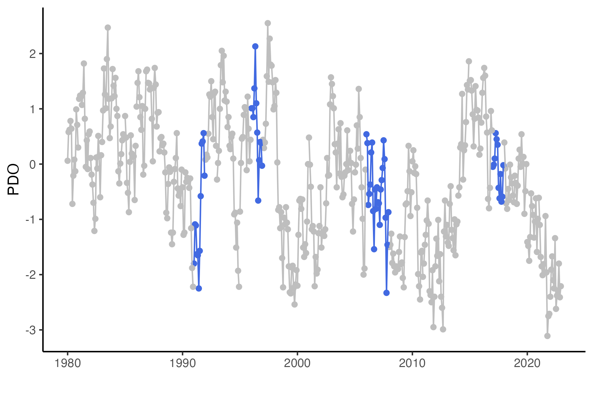
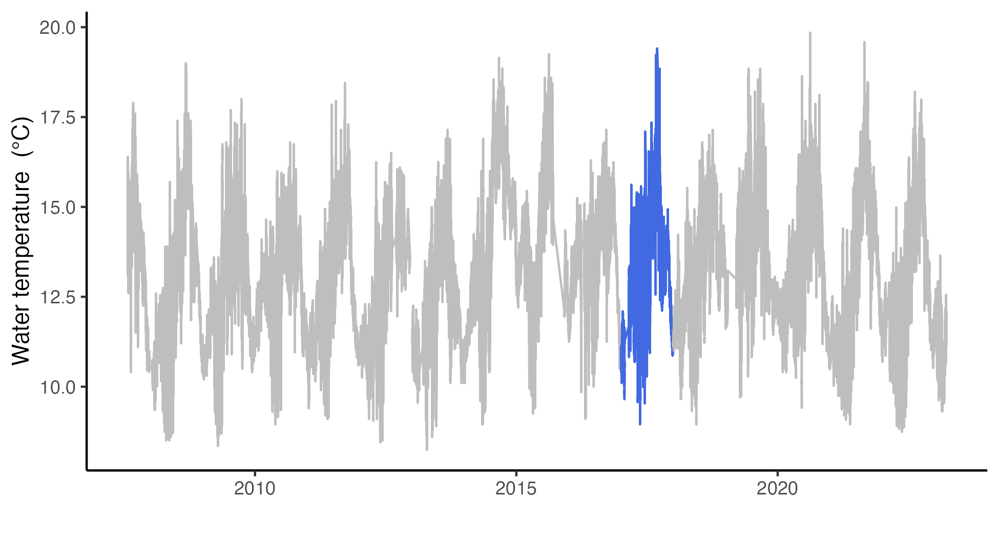
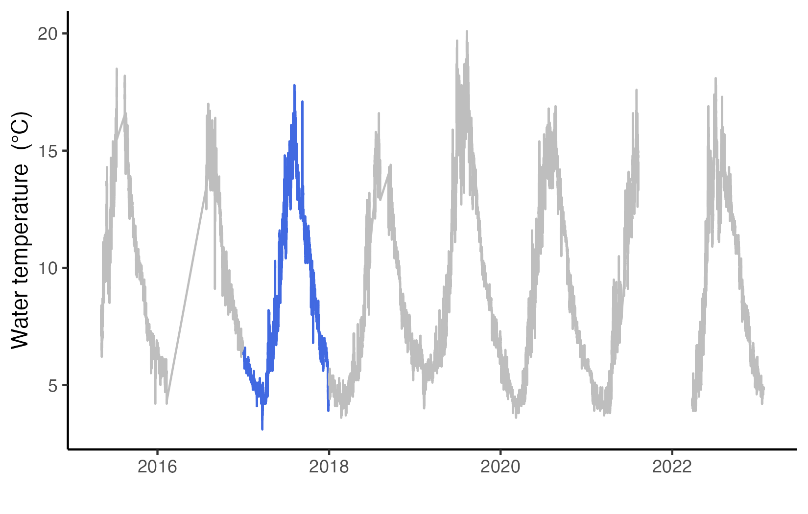
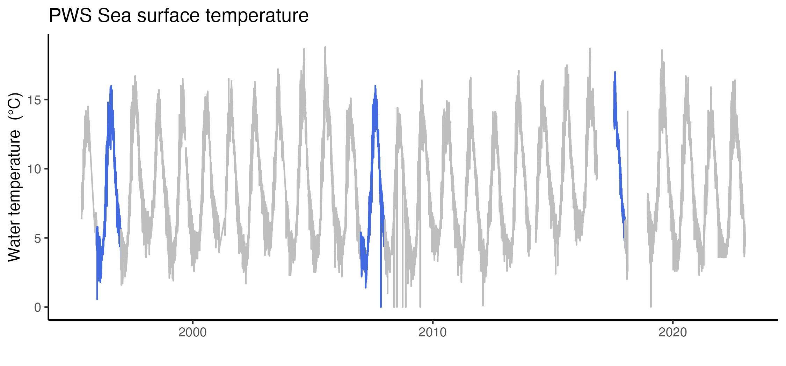
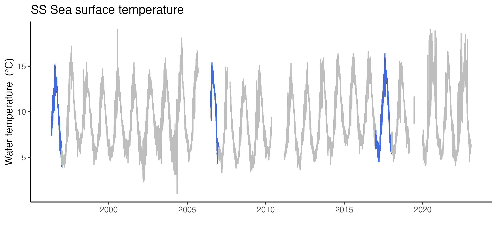
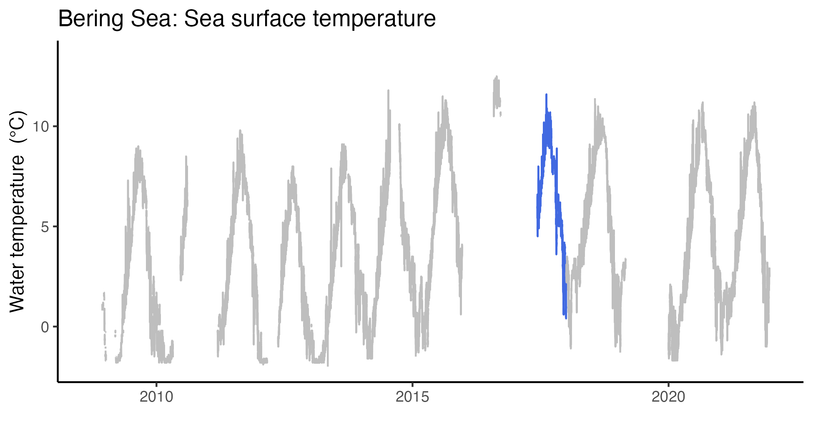
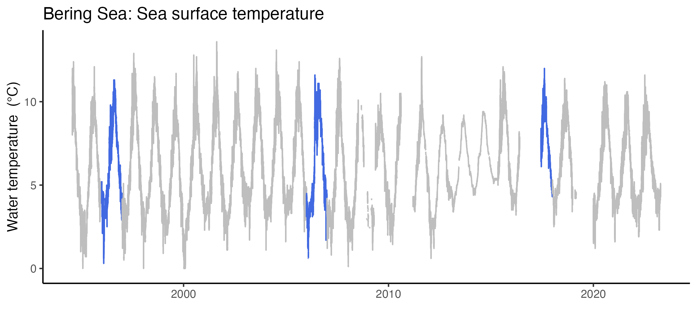
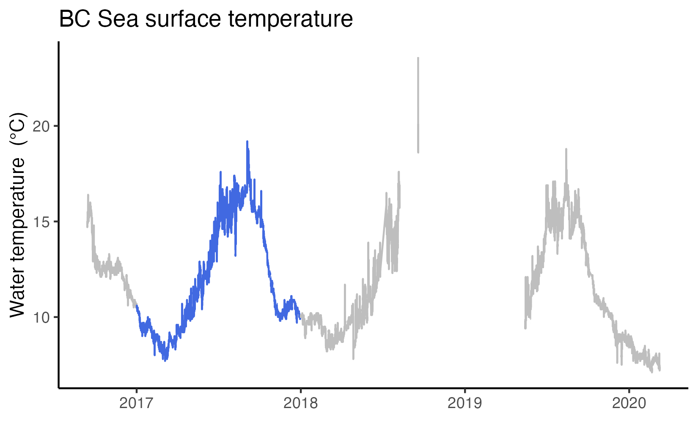
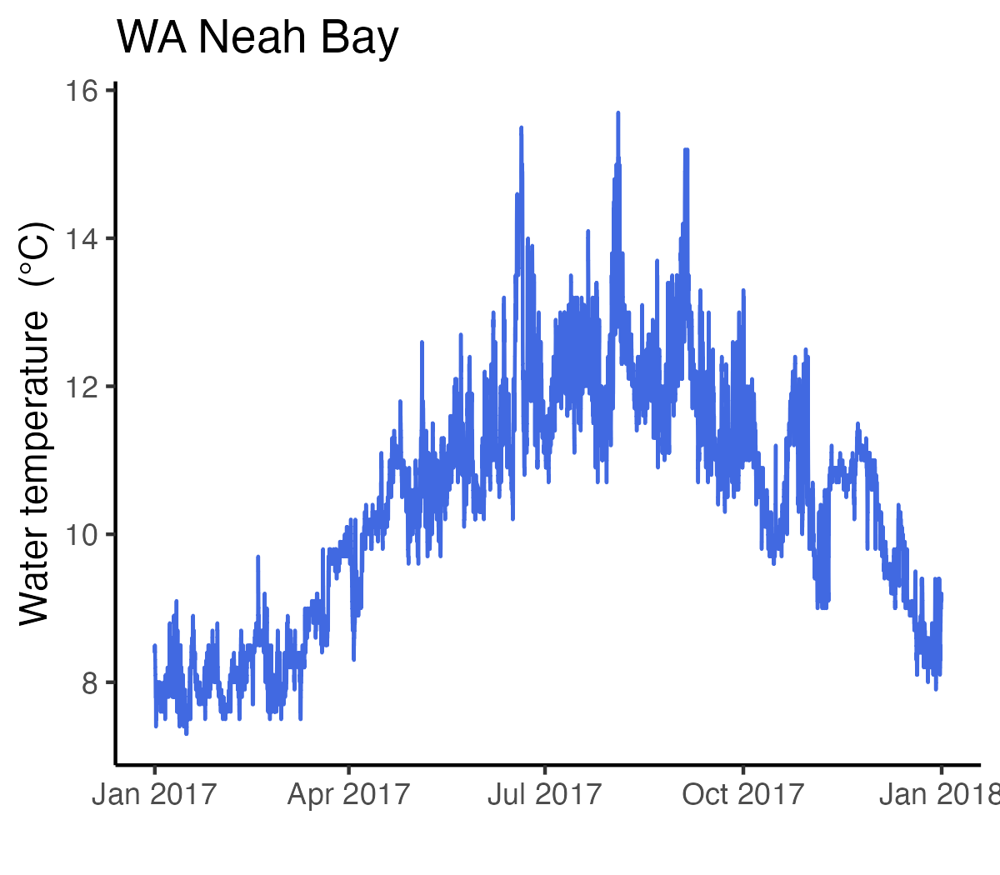
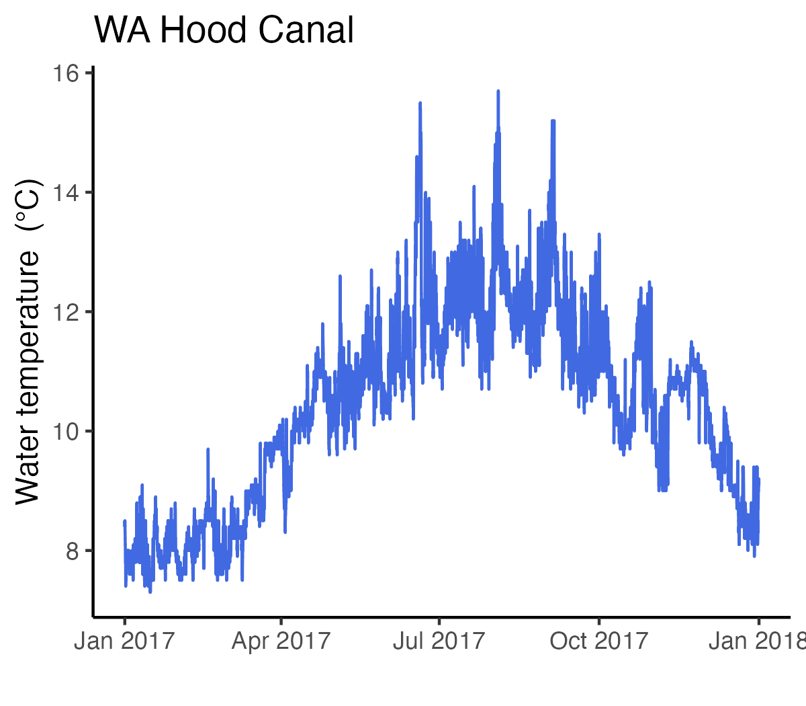

```{r eval=FALSE, message=FALSE, warning=FALSE}
library(ggplot2)
library(reshape2)
library(gridExtra)
library(scales)
source("../Rscripts/BaseScripts.R")
library(data.table)
```


# Prepare allele frequency files for PCA  
## Read frequency files from ANGSD  
```{r eval=FALSE, message=FALSE, warning=FALSE}
pops<-c("PWS91","PWS96","PWS07","PWS17","SS96","SS06","SS17","TB91","TB96","TB06","TB17")
freqs<-data.frame(r=1:394005)
for (i in 1: length(pops)){
    df<-fread(paste0("../Data/new_vcf/AF/3pops/AF3pops_",pops[i],"_maf05.mafs.gz"))
    df<-df[, "knownEM"]
    colnames(df)<-pops[i]
    freqs<-cbind(freqs, df)
}
#convert it to major allele freq table
freqs<-freqs[,-1]
f2<-1-freqs

# freq=0 cannot be processed for standardization
# 1. replace 0 with a small number
f2[f2==0]<-0.0000000001
write.csv(f2,"../Data/new_vcf/AF/3pops/major_freqs_zeroReplaced.csv", row.names=F)
write.csv(f2[,1:4], "../Data/new_vcf/AF/3pops/major_freqs_PWS_zeroReplaced.csv", row.names=F)
write.csv(f2[,5:7], "../Data/new_vcf/AF/3pops/major_freqs_SS_zeroReplaced.csv", row.names=F)
write.csv(f2[,8:11], "../Data/new_vcf/AF/3pops/major_freqs_TB_zeroReplaced.csv", row.names=F)
write.csv(f2[,1:7], "../Data/new_vcf/AF/3pops/major_freqs_PWSSS_zeroReplaced.csv", row.names=F)

#2. remove the sites with 0

f3<-1-freqs
f3<-f3[apply(f3,1, function(x) all(x!= 0)),]
#386751 loci
write.csv(f3,"Data/new_vcf/AF/3pops/major_freqs_zeroRemoved.csv", row.names=F)

```


## Run pca.py from cvtkpy 
* The pca.py runs PCA on allele freqency data after standardization. 
* Results from zero-replaced vs. zero-removed did not change much, so using the zeroreplaced version.  

# Read the PCA results   

## All populations together  
```{r eval=FALSE, message=FALSE, warning=FALSE}
df1<-read.csv("../Data/pca/pca_df_zeroReplaced.csv")

df1$id<-pops
df1$id<-factor(df1$id, levels=pops)
colgrad<-c("#d7b5d8","#df65b0","#dd1c77","#980043","#bae4b3","#74c476","#31a354", "#bdd7e7","#6baed6","#3182bd","#08519c")

ggplot(df1,aes(x=pc1, y=pc2, color=id))+
    geom_point(size=3, alpha=0.8)+
    geom_path(aes(x=pc1, y=pc2,group=pop),linetype = 1, size=0.2)+
    theme_classic()+
    scale_color_manual(values=colgrad,labels=c("PWS","SS", "TB", rep("",times=8)))+
    theme(legend.title = element_blank())+
    xlab("PC1")+ylab("PC2")+
    guides(color = guide_legend(override.aes = list(color=c(colgrad[3],colgrad[6],colgrad[10],rep("white", times=8))), title=element_blank()))
ggsave("../Output/PCA/3pops_AF_standardized_pca.png", width = 5.5, height = 4.8, dpi=300)
    
```
 

## Plot separately  

```{r eval=FALSE, message=FALSE, warning=FALSE}
#TB
tb<-df1[df1$pop=="TB",]
ggplot(tb,aes(x=pc1, y=pc2, color=id))+
    geom_point(size=3)+
    geom_path(aes(x=pc1, y=pc2,group=pop),linetype = 1, size=0.2)+
    theme_classic()+ggtitle("TB")+
    scale_color_manual(values=colgrad[8:11], labels=c("1991","1996","2006","2017"))+
    theme(legend.title = element_blank())+
    xlab("PC1")+ylab("PC2")
ggsave("../Output/PCA/3pops_AF_standardized_pca_TB.png", width = 6, height = 5, dpi=300)

pops2<-df1[df1$pop!="TB",]
ggplot(pops2,aes(x=pc1, y=pc2, color=id))+
    geom_point(size=3)+
    geom_path(aes(x=pc1, y=pc2,group=pop),linetype = 1, size=0.2)+
    theme_classic()+ggtitle("PWS & SS")+
    scale_color_manual(values=colgrad[1:7])+
    theme(legend.title = element_blank())+
    xlab("PC1")+ylab("PC2")
ggsave("../Output/PCA/3pops_AF_standardized_pca_PWS.SS_2.png", width = 6, height = 5, dpi=300)


ggplot(tb,aes(x=pc1, y=pc2, color=id))+
    geom_point(size=7)+
    geom_path(aes(x=pc1, y=pc2,group=pop),linetype = 1, size=0.2)+
    theme_classic()+ggtitle("TB")+
    scale_color_manual(values=colgrad[8:11], guide='none')+
    theme(legend.title = element_blank())+
    xlab("PC1")+ylab("PC2")+
     annotate(geom="text", x=tb$pc1[tb$year==1991], y=tb$pc2[tb$year==1991], label="91",color ='black', size=4)+
    annotate(geom="text", x=tb$pc1[tb$year==1996], y=tb$pc2[tb$year==1996], label="96",color ='black', size=4)+
    annotate(geom="text", x=tb$pc1[tb$year==2006], y=tb$pc2[tb$year==2006], label="06",color ='white', size=4)+
    annotate(geom="text", x=tb$pc1[tb$year==2017], y=tb$pc2[tb$year==2017], label="17",color ='white', size=4)
    xlim(-10,30)+ylim(-18,25)
ggsave("../Output/PCA/3pops_AF_standardized_pca_TB_zoomedin.png", width = 4.2, height =4, dpi=300)
   
ggplot(pops2,aes(x=pc1, y=pc2, color=id))+
    geom_point(size=7)+
    geom_path(aes(x=pc1, y=pc2,group=pop),linetype = 1, size=0.2)+
    theme_classic()+ggtitle("PWS & SS")+
    scale_color_manual(values=colgrad[1:7], labels=c("PWS","SS", rep("",times=5)))+
    theme(legend.title = element_blank())+
    xlab("PC1")+ylab("PC2")+
    guides(color = guide_legend(override.aes = list(color=c(colgrad[3],colgrad[6],rep("white", times=5))), title=element_blank()))+
    annotate(geom="text", x=pops2$pc1[pops2$pop=="PWS"&pops2$year==1991], y=pops2$pc2[pops2$pop=="PWS"&pops2$year==1991], label="91",color ='black', size=4)+
    annotate(geom="text", x=pops2$pc1[pops2$pop=="PWS"&pops2$year==1996], y=pops2$pc2[pops2$pop=="PWS"&pops2$year==1996], label="96",color ='black', size=4)+
    annotate(geom="text", x=pops2$pc1[pops2$pop=="PWS"&pops2$year==2006], y=pops2$pc2[pops2$pop=="PWS"&pops2$year==2006], label="07",color ='white', size=4)+
    annotate(geom="text", x=pops2$pc1[pops2$pop=="PWS"&pops2$year==2017], y=pops2$pc2[pops2$pop=="PWS"&pops2$year==2017], label="17",color ='white', size=4) +
        annotate(geom="text", x=pops2$pc1[pops2$pop=="SS"&pops2$year==1996], y=pops2$pc2[pops2$pop=="SS"&pops2$year==1996], label="96",color ='black', size=4)+
    annotate(geom="text", x=pops2$pc1[pops2$pop=="SS"&pops2$year==2006], y=pops2$pc2[pops2$pop=="SS"&pops2$year==2006], label="07",color ='black', size=4)+
    annotate(geom="text", x=pops2$pc1[pops2$pop=="SS"&pops2$year==2017], y=pops2$pc2[pops2$pop=="SS"&pops2$year==2017], label="17",color ='white', size=4) 
ggsave("../Output/PCA/3pops_AF_standardized_pca_PWS_SS_zoomedin.png", width = 5.5, height = 4.3, dpi=300)

```


## Run PCA separtely for each pop, PWS-SS only etc.  

```{r eval=FALSE, message=FALSE, warning=FALSE}
dfpws<-read.csv("../Data/pca/pca_df_zeroReplaced_PWS.csv")

dfpws$id<-pops[1:4]
dfpws$id<-factor(dfpws$id, levels=pops[1:4])
colgrad<-c("#d7b5d8","#df65b0","#dd1c77","#980043","#bae4b3","#74c476","#31a354", "#bdd7e7","#6baed6","#3182bd","#08519c")

ggplot(dfpws,aes(x=pc1, y=pc2, color=id))+
    geom_point(size=3)+
    geom_path(aes(x=pc1, y=pc2,group=pop),linetype = 1, size=0.2)+
    theme_classic()+ggtitle("PWS")+
    scale_color_manual(values=colgrad, labels=c("1991","1996","2006","2017"))+
    theme(legend.title = element_blank())+
    xlab("PC1")+ylab("PC2")
ggsave("../Output/PCA/3pops_AF_standardized_pca_PWSonly.png", width = 6, height = 5, dpi=300)

#TB
dftb<-read.csv("../Data/pca/pca_df_zeroReplaced_TB.csv")

dftb$id<-pops[8:11]
dftb$id<-factor(dftb$id, levels=pops[8:11])

ggplot(dftb,aes(x=pc1, y=pc2, color=id))+
    geom_point(size=3)+
    geom_path(aes(x=pc1, y=pc2,group=pop),linetype = 1, size=0.2)+
    theme_classic()+ggtitle("TB")+
    scale_color_manual(values=colgrad[8:11], labels=c("1991","1996","2006","2017"))+
    theme(legend.title = element_blank())+
    xlab("PC1")+ylab("PC2")
ggsave("../Output/PCA/3pops_AF_standardized_pca_TBonly.png", width = 6, height = 5, dpi=300)

#SS
dfss<-read.csv("../Data/pca/pca_df_zeroReplaced_SS.csv")
dfss$id<-pops[5:7]
dfss$id<-factor(dfss$id, levels=pops[5:7])

ggplot(dfss,aes(x=pc1, y=pc2, color=id))+
    geom_point(size=3)+
    geom_path(aes(x=pc1, y=pc2,group=pop),linetype = 1, size=0.2)+
    theme_classic()+ggtitle("SS")+
    scale_color_manual(values=colgrad[5:7], labels=c("1996","2006","2017"))+
    theme(legend.title = element_blank())+
    xlab("PC1")+ylab("PC2")
ggsave("../Output/PCA/3pops_AF_standardized_pca_SSonly.png", width = 6, height = 5, dpi=300)


#PWS&SS
dfpwss<-read.csv("../Data/pca/pca_df_zeroReplaced_PWS.SS.csv")
dfpwss$id<-pops[1:7]
dfpwss$id<-factor(dfpwss$id, levels=pops[1:7])

ggplot(dfpwss,aes(x=pc1, y=pc2, color=id))+
    geom_point(size=3)+
    geom_path(aes(x=pc1, y=pc2,group=pop),linetype = 1, size=0.2)+
    theme_classic()+ggtitle("PWS&SS")+
    scale_color_manual(values=colgrad[1:7])+
    theme(legend.title = element_blank())+
    xlab("PC1")+ylab("PC2")
ggsave("../Output/PCA/3pops_AF_standardized_pca_PWS_SSonly.png", width = 6, height = 5, dpi=300)


ggplot(dfpwss,aes(x=pc1, y=pc2, color=id))+
    geom_point(size=5)+
    geom_path(aes(x=pc1, y=pc2,group=pop),linetype = 1, size=0.2)+
    theme_classic()+ggtitle("PWS & SS")+
    scale_color_manual(values=colgrad[1:7], labels=c("PWS","SS", rep("",times=5)))+
    theme(legend.title = element_blank())+
    xlab("PC1")+ylab("PC2")+
    guides(color = guide_legend(override.aes = list(color=c(colgrad[3],colgrad[6],rep("white", times=5))), title=element_blank()))+
    annotate(geom="text", x=dfpwss$pc1[dfpwss$pop=="PWS"&dfpwss$year==1991], y=dfpwss$pc2[dfpwss$pop=="PWS"&dfpwss$year==1991], label="91",color ='black', size=3)+
    annotate(geom="text", x=dfpwss$pc1[dfpwss$pop=="PWS"&dfpwss$year==1996], y=dfpwss$pc2[dfpwss$pop=="PWS"&dfpwss$year==1996], label="96",color ='black', size=3)+
    annotate(geom="text", x=dfpwss$pc1[dfpwss$pop=="PWS"&dfpwss$year==2006], y=dfpwss$pc2[dfpwss$pop=="PWS"&dfpwss$year==2006], label="07",color ='white', size=3)+
    annotate(geom="text", x=dfpwss$pc1[dfpwss$pop=="PWS"&dfpwss$year==2017], y=dfpwss$pc2[dfpwss$pop=="PWS"&dfpwss$year==2017], label="17",color ='white', size=3) +
        annotate(geom="text", x=dfpwss$pc1[dfpwss$pop=="SS"&dfpwss$year==1996], y=dfpwss$pc2[dfpwss$pop=="SS"&dfpwss$year==1996], label="96",color ='black', size=3)+
    annotate(geom="text", x=dfpwss$pc1[dfpwss$pop=="SS"&dfpwss$year==2006], y=dfpwss$pc2[dfpwss$pop=="SS"&dfpwss$year==2006], label="07",color ='black', size=3)+
    annotate(geom="text", x=dfpwss$pc1[dfpwss$pop=="SS"&dfpwss$year==2017], y=dfpwss$pc2[dfpwss$pop=="SS"&dfpwss$year==2017], label="17",color ='white', size=3) 
ggsave("../Output/PCA/3pops_AF_standardized_pca_PWS_SSonly_text.png", width = 5.5, height = 4.3, dpi=300)

    
ggplot(dftb,aes(x=pc1, y=pc2, color=id))+
    geom_point(size=7)+
    geom_path(aes(x=pc1, y=pc2,group=pop),linetype = 1, size=0.2)+
    theme_classic()+ggtitle("TB")+
    scale_color_manual(values=colgrad[8:11], guide='none')+
    theme(legend.title = element_blank())+
    xlab("PC1")+ylab("PC2")+
     annotate(geom="text", x=dftb$pc1[dftb$pop=="TB"&dftb$year==1991], y=dftb$pc2[dftb$pop=="TB"&dftb$year==1991], label="91",color ='black', size=4)+
    annotate(geom="text", x=dftb$pc1[dftb$pop=="TB"&dftb$year==1996], y=dftb$pc2[dftb$pop=="TB"&dftb$year==1996], label="96",color ='black', size=4)+
    annotate(geom="text", x=dftb$pc1[dftb$pop=="TB"&dftb$year==2006], y=dftb$pc2[dftb$pop=="TB"&dftb$year==2006], label="06",color ='white', size=4)+
    annotate(geom="text", x=dftb$pc1[dftb$pop=="TB"&dftb$year==2017], y=dftb$pc2[dftb$pop=="TB"&dftb$year==2017], label="17",color ='white', size=4)+
    xlim(-10,30)+ylim(-18,25)
ggsave("../Output/PCA/3pops_AF_standardized_pca_TBonly_text.png", width = 4.3, height = 4, dpi=300)
   
    

```


# Check the Pacific Decadal Oscillation Index

```{r eval=FALSE, message=FALSE, warning=FALSE}
## Data from NOAA https://www.ncei.noaa.gov/access/monitoring/pdo/

pdo<-read.csv("../Output/BayEnv/PDO_indicies.csv")
#remove 2023 
pdo<-pdo[pdo$Year!=2023,]
#1. year average

pdo$mean<-rowMeans(pdo[,2:13])

#plot the obervation years
pdo$mean[pdo$Year %in% c(1991,1996,2006,2007,2017)]
#[1] -0.87916667  0.68333333 -0.35083333 -0.70250000 -0.09333333
months<-1:12
months<-sapply(months, function(x) ifelse(nchar(x)==1, paste0("0",x), x))
colnames(pdo)[2:13]<-months

pdom<-melt(pdo, id.vars = "Year")

library(lubridate)
pdom$date<-paste0(pdom$Year,"-",pdom$variable)
pdom$date2<-fast_strptime(pdom$date, "%Y-%m")
pdom$date2<-as.Date(pdom$date2)
pdom<-pdom[pdom$Year>=1980,]
pdom$color<-"a"
pdom$color[pdom$Year %in% c(1991,1996,2006,2007,2017)]<-"b"

ggplot(pdom, aes(x=date2, y=value, color=color))+
    geom_point()+ylab("PDO")+
    xlab("")+
    scale_color_manual(values=c("gray","royalblue"), guide="none")+
    geom_path(aes(group=Year, color=color))+
    theme_classic()
ggsave("../Output/BayEnv/PDO_indicies_obs_years.png", width = 6, height = 4, dpi=300)

```
 

# Check the ENSO Index

```{r eval=FALSE, message=FALSE, warning=FALSE}
## Data from NOAA https://psl.noaa.gov/enso/mei/

enso<-read.table("../Data/env_data/meiv2.data.txt")
#remove 2023 
enso<-enso[enso$V1!=2023,]

enso$mean<-rowMeans(enso[,2:13])

months<-1:12
months<-sapply(months, function(x) ifelse(nchar(x)==1, paste0("0",x), x))
colnames(enso)[1:13]<-c("Year",months)

ensom<-melt(enso, id.vars = "Year")

ensom$date<-paste0(ensom$Year,"-",ensom$variable)
ensom$date2<-fast_strptime(ensom$date, "%Y-%m")
ensom$date2<-as.Date(ensom$date2)
ensom$color<-"a"
ensom$color[ensom$Year %in% c(1991,1996,2006,2007,2017)]<-"b"

ggplot(ensom, aes(x=date2, y=value, color=color))+
    geom_point()+ylab("ENSO")+
    xlab("")+
    scale_color_manual(values=c("gray","royalblue"), guide="none")+
    geom_path(aes(group=Year, color=color))+
    theme_classic()
ggsave("../Output/BayEnv/ENSO_indicies_obs_years.png", width = 6, height = 4, dpi=300)

```


# Water Temperature

## CA

```{r eval=FALSE, message=FALSE, warning=FALSE}

ca<-read.csv("../Data/env_data/SFBay_COOS_data.csv")
ca<-ca[-1,1:2]
ca<-ca[ca$sea_water_temperature!="NaN",]
ca$sea_water_temperature<-as.numeric(ca$sea_water_temperature)
ca$Date<-fast_strptime(ca$time, "%Y-%m-%dT%H:%M:%SZ" , tz="UTC")
ca$Year<-as.integer(format(ca$Date, format="%Y"))
ca$color<-"a"
ca$color[ca$Year %in% c(2017)]<-"b"

ggplot(ca, aes(x=as.POSIXct(Date), y=sea_water_temperature))+
    geom_path(aes(group=Year, color=color))+
    theme_classic()+
    xlab('')+ylab('Water temperature  (\u00B0C)')+
    scale_color_manual(values=c("gray","royalblue"), guide='none')
ggsave("../Output/BayEnv/CA_sea_temperature_2007-2022.png", width=6.5, height=3.5, dpi=300)


#Year max and min
max(ca$sea_water_temperature[ca$Year==2017])
#19.41

min(ca$sea_water_temperature[ca$Year==2017])
#8.950012

mean(ca$sea_water_temperature[ca$Year==2017])
#13.43375 

```


## PWS
```{r eval=FALSE, message=FALSE, warning=FALSE}
#PWS water temperature
tp<-read.csv("../Data/env_data/PWS_46060_NOAA.csv")
tp<-tp[-1,]

tp<-tp[tp$sea_water_temperature!="NaN",]
tp$sea_water_temperature<-as.numeric(tp$sea_water_temperature)

tp$Date<-fast_strptime(tp$time, "%Y-%m-%dT%H:%M:%SZ" , tz="UTC")
tp$Year<-as.integer(format(tp$Date, format="%Y"))
tp$color<-"a"
tp$color[tp$Year %in% c(1991,1996,2007,2017)]<-"b"

ggplot(tp, aes(x=as.POSIXct(Date), y=sea_water_temperature))+
    geom_path(aes(group=Year, color=color))+
    theme_classic()+
    xlab('')+ylab('Water temperature  (\u00B0C)')+
    scale_color_manual(values=c("gray","royalblue"), guide='none')
ggsave("../Output/BayEnv/PWS_sea_temperature_2015-2022.png", width=5.5, height=3.5, dpi=300)

#mean
mean(tp$sea_water_temperature[tp$Year==2017])
#8.556586
min(tp$sea_water_temperature[tp$Year==2017])
#3.1
max(tp$sea_water_temperature[tp$Year==2017])
#17.8

## Longer years
#Station 46061 (LLNR 1131) - Seal Rocks - Between Montague and Hinchinbrook Islands, AK from
# https://www.ndbc.noaa.gov/station_history.php?station=46080

tempfiles<-list.files("../Data/env_data/PWS/")
Temp<-data.frame()
for (i in 1: length(tempfiles)){
    df<-fread(paste0("../Data/env_data/PWS/", tempfiles[i]))
    if ("YYYY" %in% colnames(df)){
        if (!("mm" %in% colnames(df))){
            df$mm<-00
            df<-df[,c("YYYY","MM","DD","hh","mm","WTMP")]
        }
        else df<-df[,c("YYYY","MM","DD","hh","mm","WTMP")]
        Temp<-rbind(Temp,df)
    }
    if ("YY" %in% colnames(df)) {
        df$mm<-00
        df<-df[,c("YY","MM","DD","hh","mm","WTMP")]
        colnames(df)[1]<-"YYYY"
        df$YYYY<-as.integer(paste0(19,df$YYYY))
        Temp<-rbind(Temp,df)
    }
    if("#YY" %in% colnames(df)){
        df<-df[-1,]
        colnames(df)[1]<-"YYYY"
        df<-df[,c("YYYY","MM","DD","hh","mm","WTMP")]
        Temp<-rbind(Temp,df)
    }
    
}
#Temp<-Temp2
Temp[,1:5]<-lapply(Temp[,1:5], function(x) as.integer(x))
Temp$WTMP<-as.numeric(Temp$WTMP)
Temp$Date<-sprintf("%d-%02d-%02d %02d:%02d", Temp$YYYY, Temp$MM, Temp$DD, Temp$hh, Temp$mm)
Temp[, Date := as.POSIXct(Temp$Date, format ="%Y-%m-%d  %H:%M")]
Temp$date<-parse_date_time(Temp$Date, "%Y-%m-%d %H:%M",tz = "UTC")
#Temp$date<-fast_strptime(Temp$Date, "%Y-%m-%d %H:%M",tz = "UTC")
write.csv(Temp[,1:7], "../Output/BayEnv/PWS_temp_1991-2022.csv", row.names = F)

Temp$color<-"a"
Temp$color[Temp$YYYY %in% c(1991,1996,2007,2017)]<-"b"

#replace 999 with NA
Temp$WTMP[Temp$WTMP==999]<-NA

ggplot(Temp, aes(x=as.POSIXct(Date), y=WTMP))+
    geom_path(aes(group=YYYY, color=color), linewidth=0.5)+
    theme_classic()+
    xlab('')+ylab('Water temperature  (\u00B0C)')+
    scale_color_manual(values=c("gray","royalblue"), guide='none')+
    ggtitle("PWS Sea surface temperature")
ggsave("../Output/BayEnv/PWS_sea_temperature_1995-2022.png", width=7.5, height=3.5, dpi=300)


```





## Sitka Sound Temperature data

```{r eval=FALSE, message=FALSE, warning=FALSE}

temps<-read.csv("../Data/env_data/Sitka_sound_yearRound_noaa.csv")
temps<-temps[-1,]
temps$Date<-fast_strptime(temps$time, "%Y-%m-%dT%H:%M:%SZ" , tz="UTC")
temps$sea_water_temperature<-as.numeric(temps$sea_water_temperature)

temps$Year<-as.integer(format(temps$Date, format="%Y"))
temps$color<-"a"
temps$color[temps$Year %in% c(1991,1996,2006,2017)]<-"b"

#2005-2006 has high numbers that must be errors 
temps$sea_water_temperature[temps$sea_water_temperature>20]<-NA
temps$month<-as.integer(format(temps$Date, format="%m"))

ggplot(temps[temps$Year==2005|temps$Year==2006,], aes(x=as.POSIXct(Date), y=sea_water_temperature))+
    geom_path()
    
temps$sea_water_temperature[temps$Year==2005&temps$month>=10 | temps$Year==2006&temps$month<=6 ]<-NA


ggplot(temps, aes(x=as.POSIXct(Date), y=sea_water_temperature))+
    geom_path(aes(group=Year, color=color))+
    theme_classic()+
    xlab('')+ylab('Water temperature  (\u00B0C)')+
    scale_color_manual(values=c("gray","royalblue"), guide='none')+
    ggtitle("SS Sea surface temperature")
    
ggsave("../Output/BayEnv/SS_sea_temperature_1996-2022.png", width=7.5, height=3.5, dpi=300)


mean(temps$sea_water_temperature[temps$Year==2017], na.rm=T)
#9.340208
min(temps$sea_water_temperature[temps$Year==2017], na.rm=T)
#4.5
max(temps$sea_water_temperature[temps$Year==2017], na.rm=T)
# 16.4

```



#Bering Sea Temperature Data

```{r eval=FALSE, message=FALSE, warning=FALSE}

tempt<-read.csv("../Data/env_data/VillageCove_St_Paul_Island_BeringSea_noaa_nos_co_ops_9464212_5073_a9fb_1945.csv")
tempt<-tempt[-1,]
tempt$Date<-fast_strptime(tempt$time, "%Y-%m-%dT%H:%M:%SZ" , tz="UTC")
tempt$sea_water_temperature<-as.numeric(tempt$sea_water_temperature)

tempt$Year<-as.integer(format(tempt$Date, format="%Y"))
tempt$color<-"a"
tempt$color[tempt$Year %in% c(1991,1996,2006,2017)]<-"b"

#2005-2006 has high numbers that must be errors 
#temps$sea_water_temperature[temps$sea_water_temperature>20]<-NA
#temps$month<-as.integer(format(temps$Date, format="%m"))


ggplot(tempt, aes(x=as.POSIXct(Date), y=sea_water_temperature))+
    geom_path(aes(group=Year, color=color))+
    theme_classic()+
    xlab('')+ylab('Water temperature  (\u00B0C)')+
    scale_color_manual(values=c("gray","royalblue"), guide='none')+
    ggtitle("Bering Sea: Sea surface temperature")
    
ggsave("../Output/BayEnv/TB_BeringSea_sea_temperature_2008-2022.png", width=6.5, height=3.5, dpi=300)

tb1718<-tempt[tempt$Year==2017|tempt$Year==2018,]
tb1718<-tb1718[!is.nan(tb1718$sea_water_temperature),]
tb1718<-tb1718[tb1718$Date<"2018-06-09 17:00:00",]
tb1718<-tb1718[1:8685,]

mean(tb1718$sea_water_temperature)
#5.16
min(tb1718$sea_water_temperature)
#-1.1
max(tb1718$sea_water_temperature)
#11.6

## Longer data from Unalaska, AK (UNLA3)
tempt<-read.csv("../Data/env_data/Unalaska_AK_UNLA3_noaa_nos_co_ops_9462620_8b02_0db4_e8a7.csv")
tempt<-tempt[-1,]
tempt$Date<-fast_strptime(tempt$time, "%Y-%m-%dT%H:%M:%SZ" , tz="UTC")
tempt$sea_water_temperature<-as.numeric(tempt$sea_water_temperature)

tempt$Year<-as.integer(format(tempt$Date, format="%Y"))
tempt$color<-"a"
tempt$color[tempt$Year %in% c(1991,1996,2006,2017)]<-"b"

tempt$sea_water_temperature[tempt$sea_water_temperature>16]<-NA

ggplot(tempt, aes(x=as.POSIXct(Date), y=sea_water_temperature))+
    geom_path(aes(group=Year, color=color))+
    theme_classic()+
    xlab('')+ylab('Water temperature  (\u00B0C)')+
    scale_color_manual(values=c("gray","royalblue"), guide='none')+
    ggtitle("Bering Sea: Sea surface temperature")
    
ggsave("../Output/BayEnv/TB_Unalaska_sea_temperature_1994-2022.png", width=7.5, height=3.5, dpi=300)


```




## BC 

```{r eval=FALSE, message=FALSE, warning=FALSE}
tempb<-read.csv("../Data/env_data/BC_SouthHecateStrait_ca_weather.csv")
tempb<-tempb[-1,]
tempb$Date<-fast_strptime(tempb$time, "%Y-%m-%dT%H:%M:%SZ" , tz="UTC")
tempb$sea_water_temperature<-as.numeric(tempb$sea_water_temperature)

tempb$Year<-as.integer(format(tempb$Date, format="%Y"))
tempb$color<-"a"
tempb$color[tempb$Year %in% c(1991,1996,2006,2017)]<-"b"

ggplot(tempb, aes(x=as.POSIXct(Date), y=sea_water_temperature))+
    geom_path(aes(group=Year, color=color))+
    theme_classic()+
    xlab('')+ylab('Water temperature  (\u00B0C)')+
    scale_color_manual(values=c("gray","royalblue"), guide='none')+
    ggtitle("BC Sea surface temperature")
    
ggsave("../Output/BayEnv/BC_sea_temperature_2017-2020.png", width=5.5, height=3.5, dpi=300)

mean(tempb$sea_water_temperature[tempb$Year==2017], na.rm=T)
#11.92098
min(tempb$sea_water_temperature[tempb$Year==2017], na.rm=T)
#7.7
max(tempb$sea_water_temperature[tempb$Year==2017], na.rm=T)
#19.2


# 46147 - South Moresby (outer sea south of Moresby Island)
tempb<-read.csv("../Data/env_data/BC_46147_South_Moresby_weather_46147_9b80_2dd0_19eb.csv")
tempb<-tempb[-1,]
tempb$Date<-fast_strptime(tempb$time, "%Y-%m-%dT%H:%M:%SZ" , tz="UTC")
tempb$sea_water_temperature<-as.numeric(tempb$sea_water_temperature)

tempb$Year<-as.integer(format(tempb$Date, format="%Y"))
tempb$color<-"a"
tempb$color[tempb$Year %in% c(1991,1996,2006,2017)]<-"b"

ggplot(tempb, aes(x=as.POSIXct(Date), y=sea_water_temperature))+
    geom_path(aes(group=Year, color=color))+
    theme_classic()+
    xlab('')+ylab('Water temperature  (\u00B0C)')+
    scale_color_manual(values=c("gray","royalblue"), guide='none')+
    ggtitle("BC South Moresby")
    
ggsave("../Output/BayEnv/BC_South_Moresby_2015-2022.png", width=6, height=3.5, dpi=300)

mean(tempb$sea_water_temperature[tempb$Year==2017], na.rm=T)
#10.16942
min(tempb$sea_water_temperature[tempb$Year==2017], na.rm=T)
#7.1
max(tempb$sea_water_temperature[tempb$Year==2017], na.rm=T)
#17


```



## WA  
```{r eval=FALSE, message=FALSE, warning=FALSE}
tempw<-read.table("../Data/env_data/WA_Neah_Bay_LLNR756_46087h2017.txt", header = T)
tempw<-tempw[,c("YY","MM","DD","hh","mm","WTMP")]
tempw$Date<-sprintf("%d-%02d-%02d %02d:%02d", tempw$YY, tempw$MM, tempw$DD, tempw$hh, tempw$mm)
tempw$date<-parse_date_time(tempw$Date, "%Y-%m-%d %H:%M",tz = "UTC")

tempw$color<-"a"
tempw$color[tempw$YY %in% c(1991,1996,2006,2017)]<-"b"

ggplot(tempw, aes(x=as.POSIXct(date), y=WTMP))+
    geom_path(aes(group=YY, color=color))+
    theme_classic()+
    xlab('')+ylab('Water temperature  (\u00B0C)')+
    scale_color_manual(values=c("gray","royalblue"), guide='none')+
    ggtitle("WA Neah Bay")
    
ggsave("../Output/BayEnv/WC_sea_temperature_2017.png", width=4, height=3.5, dpi=300)

mean(tempw$WTMP[tempw$YY==2017], na.rm=T)
#10.40983
 min(tempw$WTMP[tempw$YY==2017], na.rm=T)
#7.3
 max(tempw$WTMP[tempw$YY==2017], na.rm=T)
#15.7
 
 
 
# 2.Station PTWW1 - 9444900 - Port Townsend, WA
tempw<-read.table("../Data/env_data/WA_PortTownsend_ptww1h2017.txt")
tempw<-tempw[,c(1:5,15)]
colnames(tempw)<-c("YY","MM","DD","hh","mm","WTMP")
tempw$Date<-sprintf("%d-%02d-%02d %02d:%02d", tempw$YY, tempw$MM, tempw$DD, tempw$hh, tempw$mm)
tempw$date<-parse_date_time(tempw$Date, "%Y-%m-%d %H:%M",tz = "UTC")

tempw$color<-"a"
tempw$color[tempw$YY %in% c(1991,1996,2006,2017)]<-"b"
tempw$WTMP[tempw$WTMP==999]<-NA

ggplot(tempw, aes(x=as.POSIXct(date), y=WTMP))+
    geom_path(aes(group=YY, color=color))+
    theme_classic()+
    xlab('')+ylab('Water temperature  (\u00B0C)')+
    scale_color_manual(values=c("gray","royalblue"), guide='none')+
    ggtitle("WA Port Townsend")

#Missing some period


#Station SISW1 - Smith Island, WA
tempw<-read.table("../Data/env_data/WA_station_neaw1_NeahBay_h2017.txt")
tempw<-tempw[,c(1:5,15)]
colnames(tempw)<-c("YY","MM","DD","hh","mm","WTMP")
tempw$Date<-sprintf("%d-%02d-%02d %02d:%02d", tempw$YY, tempw$MM, tempw$DD, tempw$hh, tempw$mm)
tempw$date<-parse_date_time(tempw$Date, "%Y-%m-%d %H:%M",tz = "UTC")

tempw$color<-"a"
tempw$color[tempw$YY %in% c(1991,1996,2006,2017)]<-"b"
tempw$WTMP[tempw$WTMP==999]<-NA

ggplot(tempw, aes(x=as.POSIXct(date), y=WTMP))+
    geom_path(aes(group=YY, color=color))+
    theme_classic()+
    xlab('')+ylab('Water temperature  (\u00B0C)')+
    scale_color_manual(values=c("gray","royalblue"), guide='none')+
    ggtitle("WA Neah Bay 2")
#missing Oct-Dec

```






```{r eval=FALSE, message=FALSE, warning=FALSE}

```

